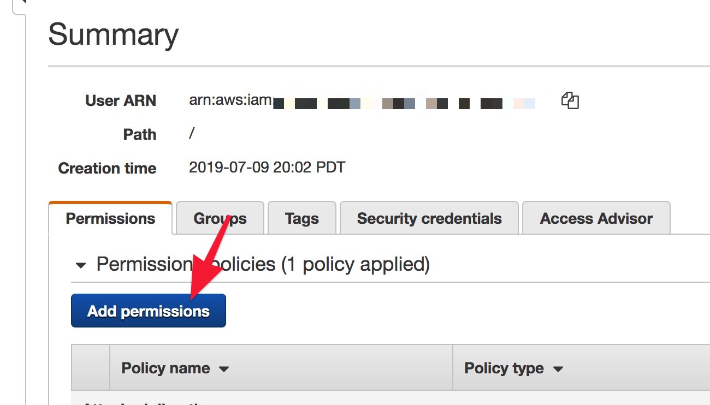
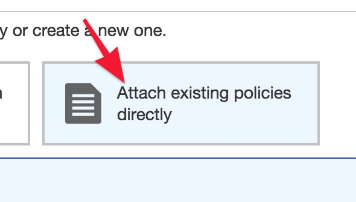

# Setting Up S3

1. [Create an S3 account](https://docs.aws.amazon.com/AmazonS3/latest/gsg/SigningUpforS3.html) and login.
1. [Create a bucket](https://docs.aws.amazon.com/AmazonS3/latest/gsg/CreatingABucket.html) to hold the backups.  Use server-side encryption.
1. [Create an access policy](https://console.aws.amazon.com/iam/home#/policies), e.g., _backup--BUCKET_ using something like the following, replacing `BUCKET` with the bucket name.

        {
            "Version": "2012-10-17",
            "Statement": [
                {
                    "Effect": "Allow",
                    "Action": [
                        "s3:PutObjectAcl",
                        "s3:DeleteObject",
                        "s3:GetObject",
                        "s3:PutObject"
                    ],
                    "Resource": [
                        "arn:aws:s3:::BUCKET/*"
                    ]
                },
                {
                    "Effect": "Allow",
                    "Action": [
                        "s3:ListBucket"
                    ],
                    "Resource": [
                        "arn:aws:s3:::BUCKET"
                    ]
                }
            ]
        }
        
1. [Create an AWS dedicated user](https://console.aws.amazon.com/iam/home#/home) with Programmatic access only to run the script.
1. Add that policy to the user.  
  
  

